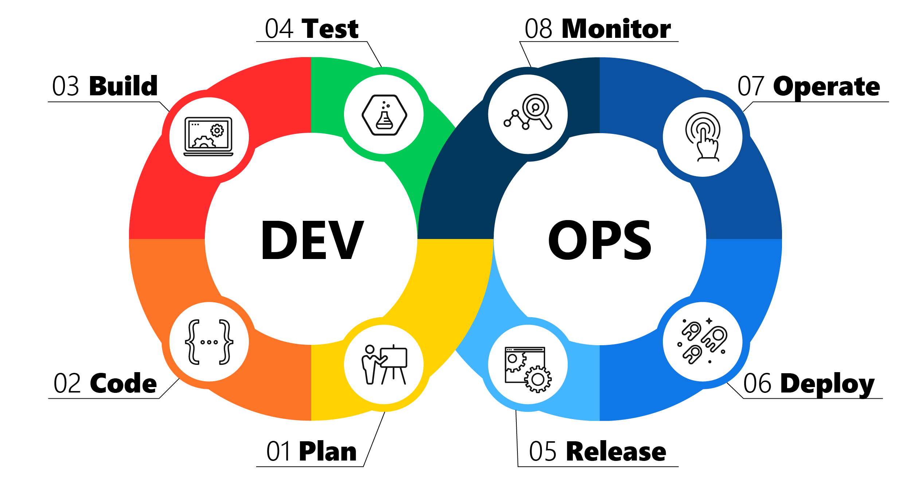

# Học DevOps 101

## DevOps là gì?

- “DevOps” viết tắt của cụm từ **Dev**elopment và **Op**eration**s**, là sự kết hợp của “phát triển” (development – Dev) và “vận hành” (operations – Ops).

- DevOps đảm bảo sự hợp tác giữa các nhóm phát triển và vận hành để triển khai code lên môi trường production một cách nhanh chóng theo quy trình lặp lại và tự động.

  - Quá trình phát triển phần mềm (Software Development) là quá trình viết mã lệnh được thực hiện bởi các lập trình viên để tạo ra phần mềm cho người sử dụng.

  - Sau khi phần mềm được tạo ra thì cần triển khai để chạy trên hệ thống. Các công việc như: xác định bao nhiêu máy chủ cần thiết, cách cấu hình các máy chủ như thế nào để có thể vận hành được phần mềm... **không** thuộc phạm vi của các lập trình viên mà thay vào đó sẽ được thực hiện bởi các người quản trị hệ thống (System Admin).

- Do đó sự giao tiếp giữa hai bộ phận là điều không thể tránh khỏi để có thể tiến hành công việc một cách trơn tru. Vấn đề nảy sinh khi các System Admin thường không hiểu rõ về lập trình phần mềm và ngược lại các lập trình viên lại thường không rành về quản trị hệ thống.

=> Mục đích của DevOps ra đời để giải quyết vấn đề và cải tiến mối quan hệ giữa hai quá trình này.
